# InstaTourist ✈️

## U2001240 Farah Afrina Dania Binti Azmir & U2102800 Magdalena Maya Anak David 

## Objectives
InstaTourist is a mobile application designed to enhance the travel experience for users by providing real-time information on nearby tourist attractions, weather forecasts, and personalized itineraries. The main objectives of the app are:

- Help users discover nearby tourist attractions based on their location.
- Provide a weekly weather forecast to assist users in planning their trips.
- Generate personalized itineraries using AI, based on the attractions around the user.

## API Used

1. **Google Places API**  
   - Used to fetch nearby tourist attractions based on the user's current location. This API helps in retrieving detailed information about places, including names, locations, ratings, and reviews.

    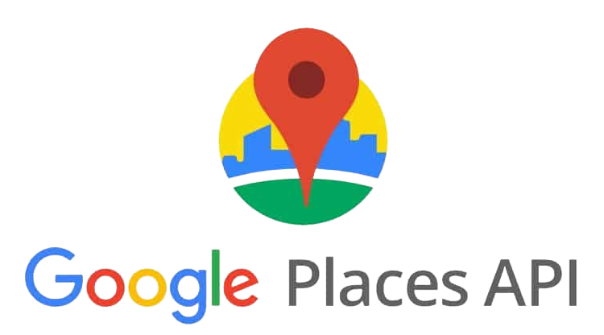

2. **Accuweather API**  
   - Provides real-time weather information and forecasts for the user’s location. It displays daily and weekly weather updates, including temperature, precipitation, and wind conditions.
   

    

     
3. **ChatGPT OpenAI API**  
   - Used to generate personalized itineraries for the user. Based on the nearby attractions identified, the API helps create travel plans tailored to the user’s preferences and time constraints.

    

## App Explanation

**InstaTourist** is designed to be a comprehensive travel companion for tourists, with a focus on discovering new places and planning trips effectively.

### 1. **Location and Nearby Attractions**  
   The app uses the **Google Places API** to identify nearby tourist spots based on the user’s current location. Users can customize the search radius to find attractions within a specific range. Each attraction displays detailed information such as reviews, ratings, and a location map.

    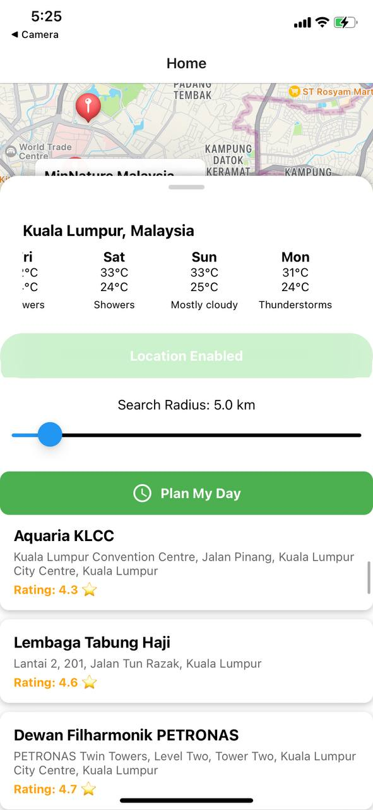

### 1. **Nearby Attractions Photos and Reviews**  
   The app uses the **Google Places API** to give info of the nearby attraction's photos and also its reviews based on the pre-existing info in Google Places. Users can now easily determine whether the tourist attraction is worth the hype and its photos with ease.
   

    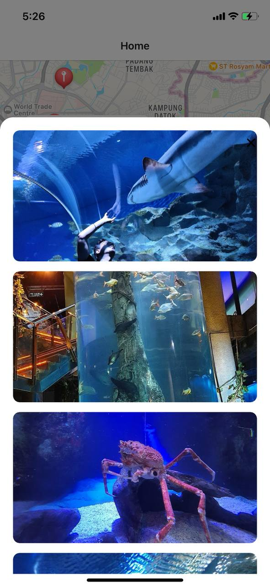
    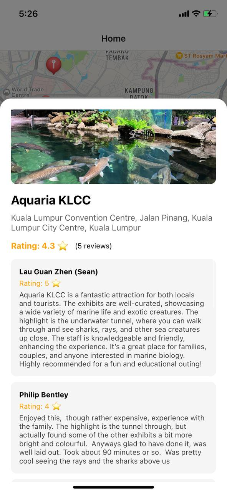

### 2. **Weather Forecast**  
   The **Accuweather API** integration provides a weather forecast feature, which helps users plan their day by giving them a forecast for the upcoming week. This includes vital information like temperature, precipitation, and general weather conditions, ensuring users are prepared for their travels.

### 3. **Plan My Day**  
   The **Plan My Day** feature utilizes the **ChatGPT OpenAI API** to generate personalized itineraries based on the nearby tourist attractions. The user can input preferences, such as types of activities they enjoy or the amount of time they have, and the app will create a suggested plan for the day.

    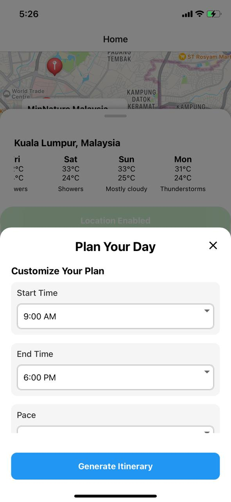
    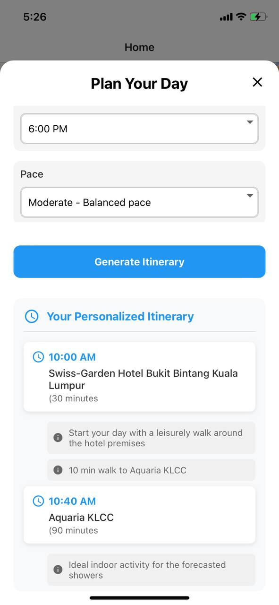
    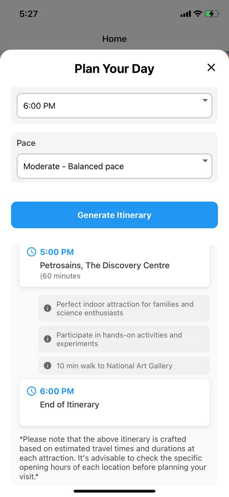

## Extra Features

    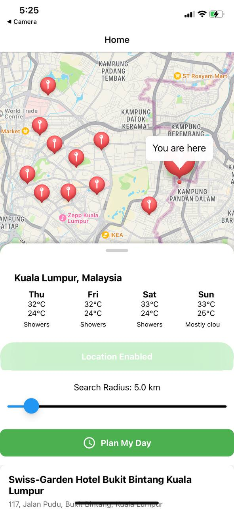
    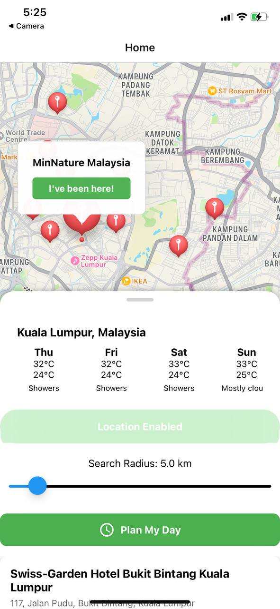
    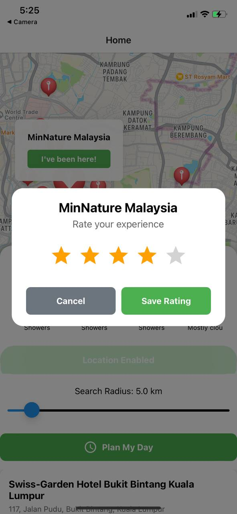
    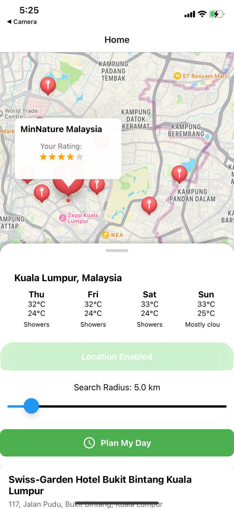

